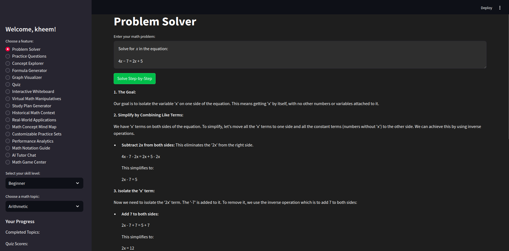

# MathTutor

**Advanced AI Math Tutor** is a Streamlit-based web application designed to help users learn and practice various mathematical concepts. It leverages AI to provide problem-solving assistance, practice questions, concept exploration, and more.

## Features

- **Problem Solver**: Solve math problems step-by-step.
- **Practice Questions**: Generate and practice custom questions.
- **Concept Explorer**: Dive deep into mathematical concepts.
- **Formula Generator**: Generate relevant formulas for selected topics.
- **Graph Visualizer**: Visualize mathematical functions and analyze their properties.
- **Quiz**: Take quizzes to test your knowledge.
- **Interactive Whiteboard**: Draw and interpret mathematical expressions.
- **Virtual Math Manipulatives**: Interactive tools for visual learning.
- **Study Plan Generator**: Create personalized study plans.
- **Performance Analytics**: Track your progress and performance.
- **AI Tutor Chat**: Interact with an AI-powered math tutor.
- **Math Game Center**: Engage with math-based games for fun learning.

## Installation

### Prerequisites

- Python 3.10 or higher
- Git

### Steps

1. **Clone the Repository**:

   ```bash
   git clone https://github.com/RohmaButt/MathTutor.git
   cd MathTutor
   ```

2. **Create a Virtual Environment**:
   ```bash
   python3 -m venv venv
   source venv/bin/activate
   ```
3. **Install Dependencies**:
   ```bash
   pip install -r requirements.txt
   ```
4. **Set Up Environment Variables**:
   ```bash
   GENAI_API_KEY=your_api_key_here
   ```
5. **Run the Application**:
   ```bash
   streamlit run Math-Tutor.py
   ```

### Screenshots

Below are some screenshots of the **MathTutor** application in action:

#### Main Interface


#### Problem Solver Feature


